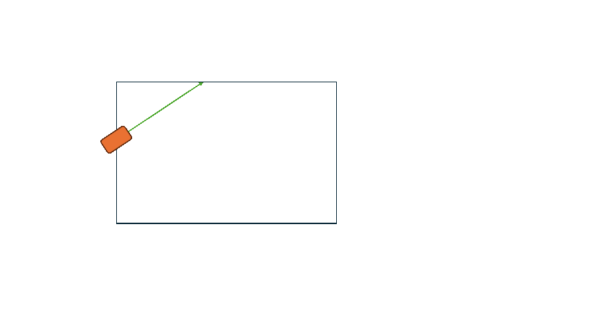
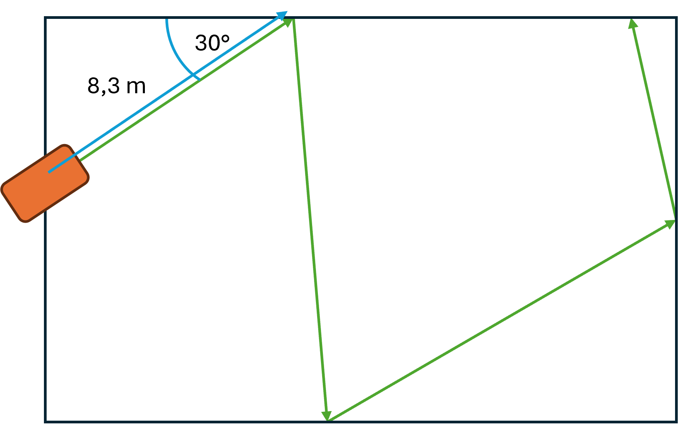
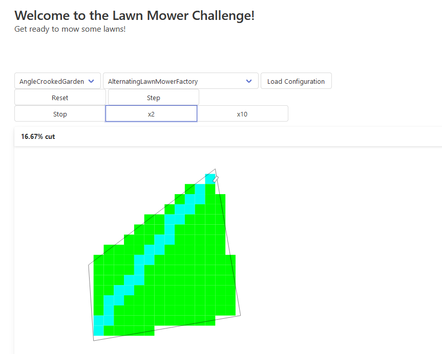
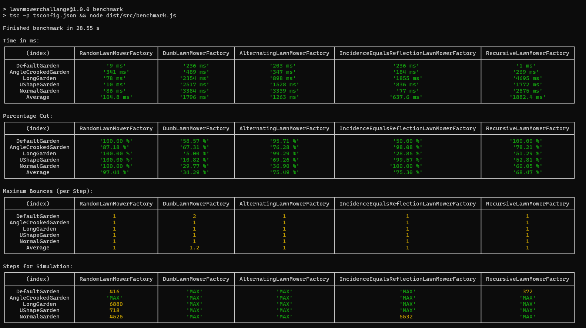
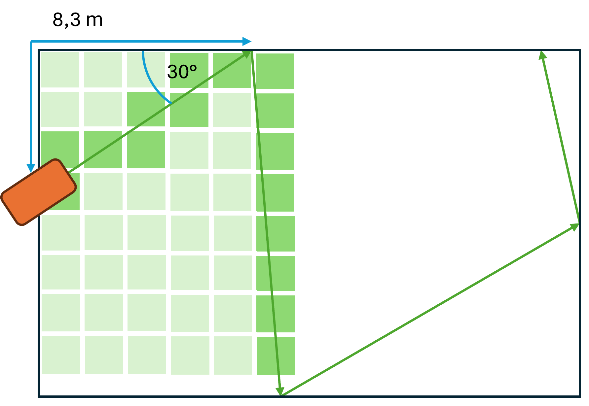

# LawnMower Challange

Robotic lawn mowers work in unpredictable movements. They orientate themselves in space with a very reduced set of sensors. The challenge is to enable the most efficient journey possible across the lawn with the reduced outside world information.

In this challenge, such a robotic mower journey is to be simulated. The participants of this programming challange are tasked to develop the most efficient algorithm possible using the reduced number of sensors to mow the entire lawn on different unknown terrains.

## The Sensors

Initially, the robot only knows the **length of the boundary wire** that is stretched around the entire property. It starts at the charging station. The angle at which it is positioned to the outer boundary is unknown.

As soon as the robotic lawnmower hits a point on the boundary wire, the robot receives two signals: 

a) The distance the robotic lawnmower drove since his last collision. 
b) The angle at which the robotic lawnmower has hit the boundary wire (measured to the left-hand side).

The robotic lawnmower must then decide at which angle it will continue to drive.

These steps are repeated until the entire lawn has been travelled over once or the maximum steps are reached.

## Run Project

1. Download the SourceCode from GitHub
2. Install the dependencies `npm install`
3. Build and run the backend `npm run backend`
4. Open the demo frontend (open public/index.html in browser):

To run a benchmark test between the different LawnMower in the different gardens run the command `npm run benchmark`:

## The Implementation

The LawnMower are defined by the [Interface ILawnMower](/blob/main/src/LawnMower/LawnMowerInterface.ts) that provides the method `handleBoundaryCollission` that gives the LawnMower the travelled distancen since the last collision and the angle between the boundary wire and the lawn mower. To provide the LawnMower important starting information about the garden there is another interface: The ILawnMowerFactory that creates a LawnMower instance out of the informations of the garden.

Participant of the challange must implement both: A LawnMower Implementation and a LawnMowerFactory. Examples can be found in the [DumbLawnMower Example](/blob/main/src/LawnMower/Default/DumbLawnMower.ts). The implemented LawnMower must then be registered in the [LawnMower getAllLawnMowerFactories method](/blob/main/src/LawnMower/LawnMower.ts#L20).

To determine whether the entire lawn area has been covered, the area is divided into pixels so called [LawnPixels](https://github.com/DumbergerL/LawnMowerChallange/blob/main/src/Simulation/Lawn.ts#L13) that are flagged when the robot ‘drives over’ them:

## TODO

Open tasks for the challenge:

- [ ] Implementation of the central control unit as a small HTTP server.
- [ ] Create better documentationen and explanation of challange.
- [ ] Find at least 6 challenge participants.
- [ ] Default implementations with simple algorithms for comparison (e.g.: mowing robot always moves at an angle of 33°; mowing robot always moves with angle of incidence = angle of egress; ...)
- [ ] Develop the structure of different plots.

Contact: [lukas.dumberger@gmail.com](mailto:lukas.dumberger@gmail.com)
