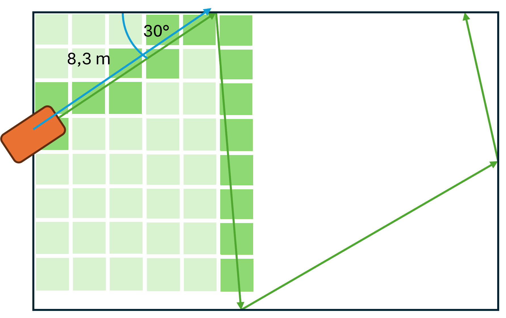

# LawnMower Challange

Robotic lawn mowers work in unpredictable movements. They orientate themselves in space with a very reduced set of sensors. The challenge is to enable the most efficient journey possible across the lawn with the reduced outside world information.

In this challenge, such a robotic mower journey is to be simulated. The participants of this programming challange are tasked to develop the most efficient algorithm possible using the reduced number of sensors to mow the entire lawn on different unknown terrains.

## The Sensors

Initially, the robot only knows the **length of the boundary wire** that is stretched around the entire property. It starts at the charging station. The angle at which it is positioned to the outer boundary is unknown.

As soon as the robotic lawnmower hits a point on the boundary wire, the robot receives two signals: 

a) The length of the boundary wire from the intersection point to the charging station (left side)
b) The angle at which the robotic lawnmower has hit the boundary wire (measured to the left-hand side).

The robotic lawnmower must then decide at which angle it will continue to drive.

These steps are repeated until the entire lawn has been travelled over once.

## The Implementation

In order for the challenge to be carried out by the participants in different programming languages, the communication between the external sensors and the algorithm developed by the participant could be carried out using HTTP requests.

A small HTTP server (e.g. in JavaScript) could be developed in this repo to ‘host’ the challenge. The following endpoints are then offered for control:

- GET /landmower/status - returns the angle and the intersection boundary wire length for the current robotic lawnmower to the participant
- POST /landmower/act - the request controls the next step of the robotic lawnmower, it contains the angle in the body at which the robotic lawnmower should continue its journey. In response to this end point, the next intersection point is returned with the length to the charging station and the angle of contact. 

The POST /landmower/act end point is then called until the entire lawn has been mowed once (or a maximum number of possible ‘moves’ has been reached).

To determine whether the entire lawn area has been covered, the area is divided into pixels that are flagged when the robot ‘drives over’ them:

## TODO

Open tasks for the challenge:

- [ ] Implementation of the central control unit as a small HTTP server.
- [ ] Create better documentationen and explanation of challange.
- [ ] Find at least 6 challenge participants.
- [ ] Default implementations with simple algorithms for comparison (e.g.: mowing robot always moves at an angle of 33°; mowing robot always moves with angle of incidence = angle of egress; ...)
- [ ] Develop the structure of different plots.

Contact: [lukas.dumberger@gmail.com](mailto:lukas.dumberger@gmail.com)
